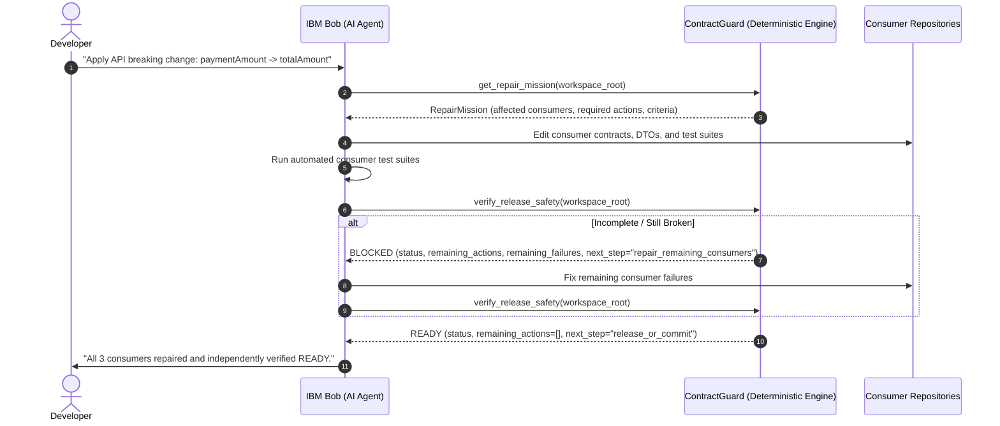

# ContractGuard — Phase 3E: Bob ↔ ContractGuard Repair / Verify Loop

## Overview

In **Phase 3E**, ContractGuard formalizes the interactive collaboration loop between the **IBM Bob AI coding agent** and **ContractGuard's deterministic verification engine**.

The core operational division remains:
> **"ContractGuard never modifies code. Bob never declares its own success."**

---

## 1. The Interaction Lifecycle



---

## 2. Deterministic Verification Gate Contract

When Bob requests verification via `verify_release_safety` or `contract-guard verify . --format json`:

### Incomplete State (BLOCKED)

```json
{
  "status": "BLOCKED",
  "is_ready": false,
  "producer_service": "payment-service",
  "evidence_id": "evidence-payment-service-a1b2c3d4",
  "mission_id": "mission-payment-service-460ca4c3",
  "contract_checks_status": "FAIL",
  "breaking_changes_count": 1,
  "consumers_checked": ["order-service", "payment-client", "reporting-service"],
  "compatible_consumers": ["order-service", "payment-client"],
  "affected_consumers": ["reporting-service"],
  "remaining_actions": [
    "Update reporting-service consumer contract (paymentAmount)"
  ],
  "remaining_failures": [
    {
      "consumer_service": "reporting-service",
      "consumer_contract": "/workspace/reporting-service/contracts/payment-service.yaml",
      "endpoint": "GET /api/payments/{id}",
      "affected_field": "paymentAmount",
      "change_kind": "field_renamed",
      "detail": "Consumer expects 'paymentAmount' but producer now uses 'totalAmount'.",
      "reason": "Consumer expects the old field name; renaming it is equivalent to removal."
    }
  ],
  "next_step": "repair_remaining_consumers"
}
```

### Verified State (READY)

```json
{
  "status": "READY",
  "is_ready": true,
  "producer_service": "payment-service",
  "evidence_id": "evidence-payment-service-e5f6g7h8",
  "mission_id": "mission-payment-service-460ca4c3",
  "contract_checks_status": "PASS",
  "breaking_changes_count": 0,
  "consumers_checked": ["order-service", "payment-client", "reporting-service"],
  "compatible_consumers": ["order-service", "payment-client", "reporting-service"],
  "affected_consumers": [],
  "remaining_actions": [],
  "remaining_failures": [],
  "next_step": "release_or_commit"
}
```

---

## 3. Key Takeaway

Bob receives concrete, actionable, deterministic signals:
- Exactly which consumer services remain incompatible.
- Exactly which endpoints and fields caused the failure.
- Exactly what action is required before the release gate can transition to `READY`.
