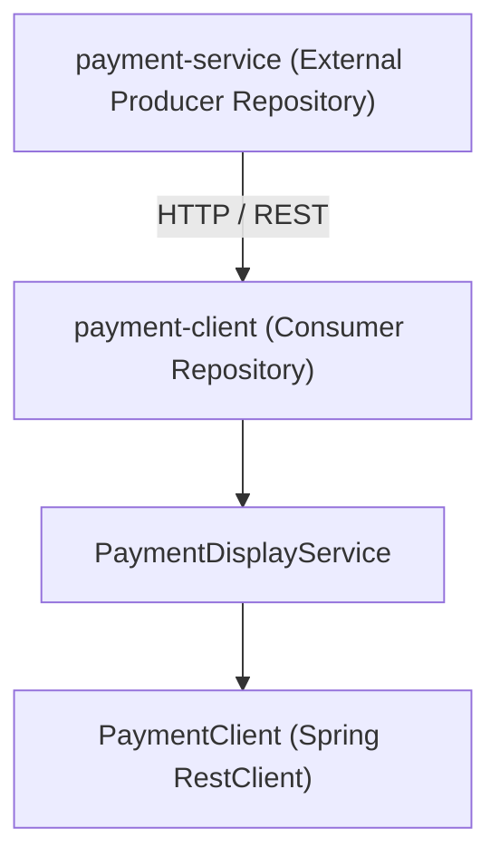

# Payment Client Architecture

This document describes the high-level architecture of `payment-client` and its interaction with the external `payment-service`.

## System Overview

`payment-client` is an **independent consumer application** that interacts with the external `payment-service` through HTTP REST calls.

## Independence of Repositories

It is critical to note that `payment-service` and `payment-client` are completely independent Git repositories:
- They do not share a common parent Maven project.
- They do not share compiled JARs, source packages, or classes.
- Communication between them takes place strictly over HTTP/REST at runtime.

## Component Responsibilities

1. **`PaymentClient`**:
   Low-level HTTP client component built with Spring's `RestClient`. It connects to the configured base URL (`payment.service.base-url`) and queries `/api/payments/{id}`.

2. **`PaymentResponse`**:
   Consumer-side data model capturing the response payload. It defines the exact schema this consumer expects from the producer.

3. **`PaymentDisplayService`**:
   Business service layer demonstrating consumption of the payment data retrieved by `PaymentClient`.

4. **`contracts/payment-service.yaml`**:
   The local contract definition describing the exact API contract expectations of this consumer repository.
