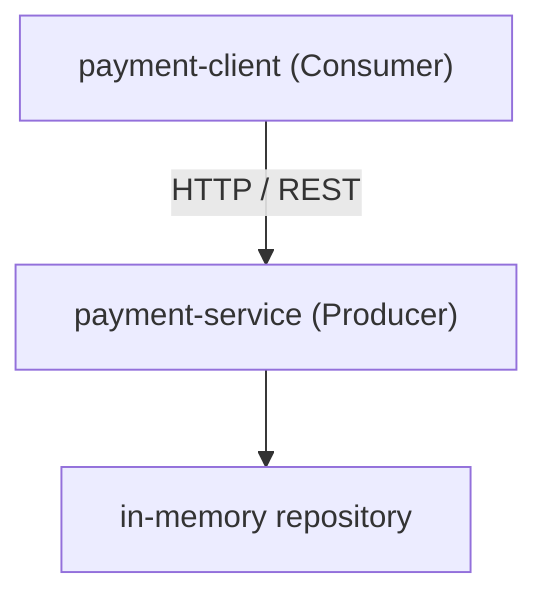
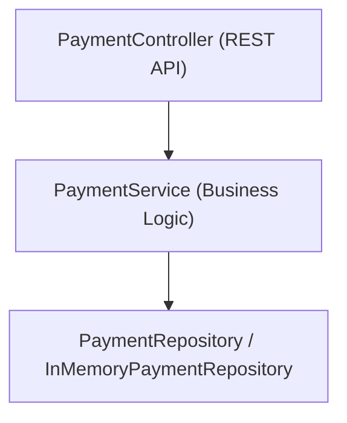

# Payment Service Architecture

This document describes the high-level architecture of `payment-service` and its role within the distributed payment ecosystem.

## Architectural Overview

`payment-service` acts as the **API Producer** in this distributed architecture. It is responsible for accepting payment requests, validating input data, persisting payment records in an in-memory repository, and serving payment lookups via HTTP REST endpoints.

## Internal Layering

The application follows a clean layered architecture:

- **Controller (`PaymentController`)**: Exposes RESTful endpoints (`POST /api/payments`, `GET /api/payments/{id}`), handles JSON serialization/deserialization, and triggers input validation.
- **Service (`PaymentService`)**: Orchestrates business rules, transforms between domain models and DTOs.
- **Repository (`InMemoryPaymentRepository`)**: Manages thread-safe storage of payments using in-memory data structures, pre-seeded with deterministic data for consistent testing and demonstration.

## Producer Responsibility

As the producer, `payment-service` defines and publishes the canonical API contract at `docs/openapi.yaml`. Any change to this contract must take into account downstream consumers (such as `payment-client`) that depend on these schemas.
